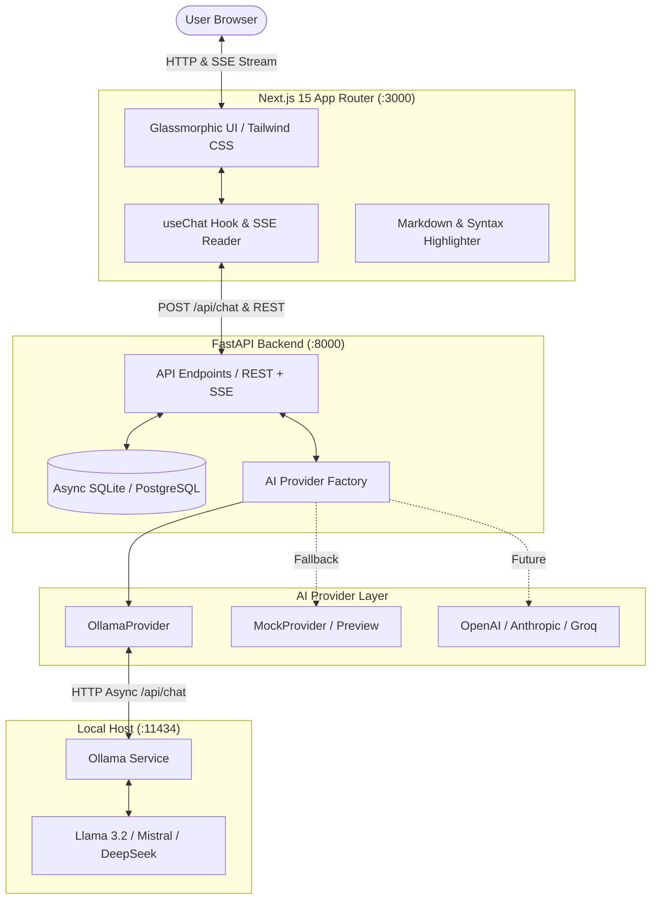

# 🌌 Solix — Futuristic Full-Stack AI Assistant

<div align="center">


<p align="center">
  <strong>An open-source, production-grade conversational AI application featuring a dark-first glassmorphic interface, real-time Server-Sent Events (SSE) streaming, extensible AI provider abstraction layer, and native local Ollama integration.</strong>
  <br />
  <sub>Designed & Developed by <strong>Agrim Kaushik</strong></sub>
</p>

[Key Features](#-key-features) • [Architecture](#-architecture) • [Getting Started](#-getting-started) • [API Reference](#-api-reference) • [Configuration](#-configuration) • [Author](#-author--maintainer)

</div>

---

## ✨ Key Features

- 💎 **Premium Glassmorphism Aesthetic**:
  - Dark-first cybernetic design (`#07090e`) with translucent glass panels (`backdrop-blur-xl`).
  - Subtle animated cyan & violet ambient glow orbs with restrained, high-performance transitions.
  - High-contrast typography designed for long reading sessions and complex code snippets.

- ⚡ **Real-Time Streaming (SSE)**:
  - Token-by-token streaming over HTTP Server-Sent Events (`text/event-stream`).
  - Native `AbortController` integration for an immediate **"Stop Generating"** action.

- 🧠 **Extensible AI Provider Abstraction**:
  - Decoupled `AIProvider` base interface — never locked into a single vendor.
  - Native **Ollama** integration connecting to local models (`llama3.2`, `mistral`, `deepseek-r1`, `qwen2.5-coder`).
  - **Smart Interactive Fallback**: When Ollama is offline or starting up, Solix automatically switches to Simulation Mode so you can preview all UI features and streaming immediately.

- 💬 **Conversation Management**:
  - Full CRUD operations with SQLite async persistence via SQLAlchemy 2.0 (PostgreSQL migration ready).
  - Automated intelligent conversation title generation derived from the user's initial prompt.
  - Sidebar conversation history grouped intuitively by date (*Today*, *Yesterday*, *Previous 7 Days*, *Older*).
  - Real-time search filter across conversation titles.
  - Inline title editing and cascade deletion.

- 📝 **Rich Markdown & Syntax Highlighting**:
  - Full GitHub Flavored Markdown (GFM) support: tables, task lists, and blockquotes.
  - Formatted code blocks with language badges and one-click clipboard copying.

- 📱 **Adaptive Responsive Design**:
  - Desktop: Collapsible glass sidebar with quick navigation.
  - Mobile & Tablet: Fluid backdrop-blurred slide-over navigation drawer.
  - Floating bottom composer with auto-expanding textarea and dynamic model switcher.

---

## 🏛 Architecture



### Directory Tree

```
SOLIX-open-source/
├── backend/
│   ├── app/
│   │   ├── api/               # API routes (chat, conversations, health, models)
│   │   ├── core/              # Config (Pydantic Settings) & Database session
│   │   ├── models/            # SQLAlchemy ORM & Pydantic schemas
│   │   ├── providers/         # AIProvider abstraction (Ollama, Mock, Factory)
│   │   ├── services/          # Business logic & conversation CRUD
│   │   └── main.py            # FastAPI entrypoint & CORS middleware
│   ├── .env.example           # Example backend configuration
│   ├── requirements.txt       # Python dependencies
│   └── test_api.py            # Automated backend integration test suite
├── frontend/
│   ├── app/                   # Next.js 15 App Router (layout, page, globals.css)
│   ├── components/            # UI components (Composer, MessageList, Sidebar, Header)
│   ├── hooks/                 # Custom React hooks (useChat)
│   ├── lib/                   # API client & SSE streaming reader
│   ├── types/                 # TypeScript type definitions
│   ├── .env.example           # Example frontend configuration
│   ├── package.json           # Frontend dependencies
│   └── tailwind.config.ts     # Glassmorphism design tokens & animations
└── README.md
```

---

## 🚀 Getting Started

### Prerequisites

- **Node.js**: `v18.17+` or `v20+` / `v24+`
- **Python**: `3.10+` (tested with Python `3.12`)
- **Git**
- **Ollama** *(optional for preview mode; required for local offline LLM generation)*

---

### 1. Clone the Repository

```bash
git clone https://github.com/itsagrim123-blip/SOLIX-open-source.git
cd SOLIX-open-source
```

---

### 2. Backend Setup (FastAPI)

```bash
cd backend

# Create a Python virtual environment
python -m venv .venv

# Activate the virtual environment
# On Windows (PowerShell):
.\.venv\Scripts\Activate.ps1
# On Windows (Command Prompt):
.\.venv\Scripts\activate.bat
# On macOS / Linux:
source .venv/bin/activate

# Install dependencies
pip install -r requirements.txt

# Configure environment
cp .env.example .env

# Run FastAPI backend with live reload
uvicorn app.main:app --reload --port 8000
```

> **Backend will be running at:** `http://localhost:8000`  
> **Interactive Swagger Documentation:** `http://localhost:8000/docs`

---

### 3. Frontend Setup (Next.js)

Open a new terminal window:

```bash
cd frontend

# Install dependencies
npm install

# Configure environment
cp .env.example .env.local

# Start development server
npm run dev
```

> **Frontend will be running at:** `http://localhost:3000`

---

### 4. Ollama Setup (Local AI Models)

1. Download and install Ollama from [ollama.com](https://ollama.com).
2. Start the daemon:
   ```bash
   ollama serve
   ```
3. Pull your favorite model:
   ```bash
   ollama pull llama3.2
   ```
   *(Or try `mistral`, `deepseek-r1`, `qwen2.5:coder`, or `phi3`)*

*Solix automatically checks `http://localhost:11434`. When Ollama is running, the status indicator turns **Online** and your local model is used. When offline, Solix automatically uses an interactive preview mode.*

---

## 📡 API Reference

| Method | Endpoint | Description |
| :--- | :--- | :--- |
| `GET` | `/api/health` | Service health status and AI provider connectivity |
| `GET` | `/api/models` | List available models and active default model |
| `POST` | `/api/chat` | Send prompt & receive SSE streaming response |
| `GET` | `/api/conversations` | List conversation summaries grouped by last update |
| `POST` | `/api/conversations` | Initialize a new conversation thread |
| `GET` | `/api/conversations/{id}` | Fetch full conversation with message history |
| `PATCH` | `/api/conversations/{id}` | Rename conversation title |
| `DELETE` | `/api/conversations/{id}` | Delete conversation and cascade-remove messages |

### Chat SSE Event Format

Streaming responses from `POST /api/chat` emit Server-Sent Events (`text/event-stream`):

```json
data: {"type": "start", "conversation_id": "uuid", "title": "Explain Quantum Superposition"}
data: {"type": "token", "content": "Quantum"}
data: {"type": "token", "content": " computing"}
data: {"type": "done", "conversation_id": "uuid", "message_id": "uuid", "full_content": "..."}
```

---

## ⚙ Configuration

### Backend (`backend/.env`)

```env
# Ollama Configuration
OLLAMA_BASE_URL=http://localhost:11434
OLLAMA_MODEL=llama3.2
OLLAMA_TIMEOUT_SECONDS=60.0

# Database Configuration (SQLite async or PostgreSQL: postgresql+asyncpg://...)
DATABASE_URL=sqlite+aiosqlite:///./solix.db

# CORS Configuration (comma-separated origins)
CORS_ORIGINS=http://localhost:3000,http://127.0.0.1:3000

# Server Binding
HOST=0.0.0.0
PORT=8000
APP_ENV=development
```

### Frontend (`frontend/.env.local`)

```env
# FastAPI Backend URL
NEXT_PUBLIC_API_URL=http://localhost:8000
```

---

## 🧩 Extending AI Providers

The application was built from the ground up to support multiple AI providers without refactoring the frontend or database.

To add a new provider (e.g. OpenAI, Anthropic, Groq):

1. Create a new provider file in `backend/app/providers/custom.py`:
   ```python
   from app.providers.base import AIProvider

   class CustomProvider(AIProvider):
       @property
       def name(self) -> str:
           return "custom"

       async def generate_stream(self, messages, model=None, temperature=None, system_prompt=None):
           # Stream tokens via yield
           yield "token"

       async def list_models(self):
           return [{"id": "custom-model", "name": "Custom Model", "is_default": True}]

       async def check_health(self):
           return True
   ```
2. Register your provider in `backend/app/providers/factory.py`.

---

## 🧪 Running Tests

The backend includes a self-contained in-memory integration test suite verifying health checks, model tags, conversation persistence, and SSE token streaming:

```bash
cd backend
.\.venv\Scripts\python.exe test_api.py
```

To run frontend production validation:
```bash
cd frontend
npm run build
```

---

## 🛡 Security & Best Practices

- **Zero Client-Side Keys**: The frontend never communicates with AI backends directly; all operations are mediated securely through FastAPI.
- **Strict CORS & Input Validation**: All requests are validated with Pydantic v2 schemas.
- **SQL Injection Immune**: Built with SQLAlchemy 2.0 ORM parameterized queries.

---

## 👤 Author & Maintainer

**Agrim Kaushik**
- GitHub: [@itsagrim123-blip](https://github.com/itsagrim123-blip)
- Repository: [SOLIX-open-source](https://github.com/itsagrim123-blip/SOLIX-open-source)

---

## 📄 License

Distributed under the **MIT License**. See `LICENSE` for more information.

---

<div align="center">
  <sub>Designed & Developed with ❤️ by <strong>Agrim Kaushik</strong> for the open-source AI community. Star ⭐ this repository if you find it helpful!</sub>
</div>
